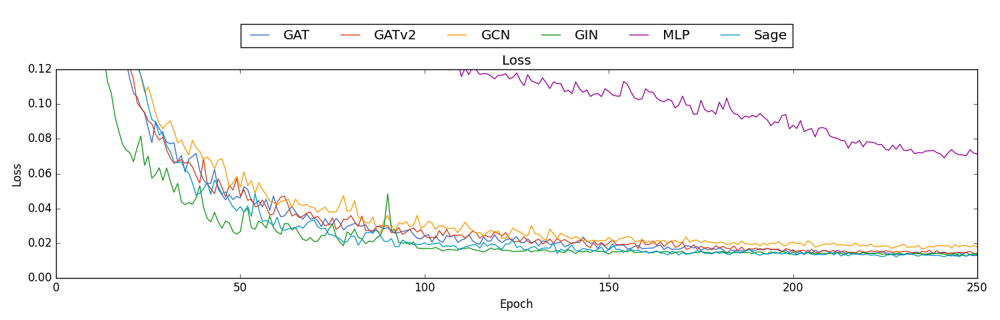
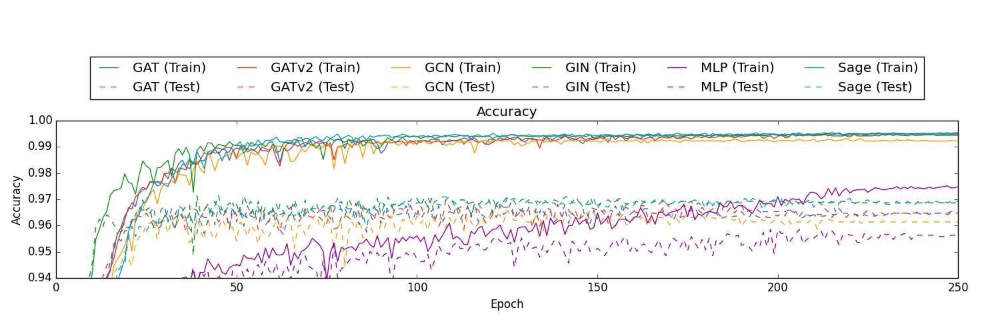
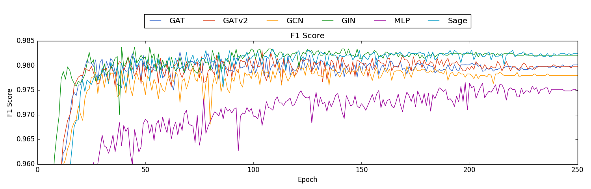
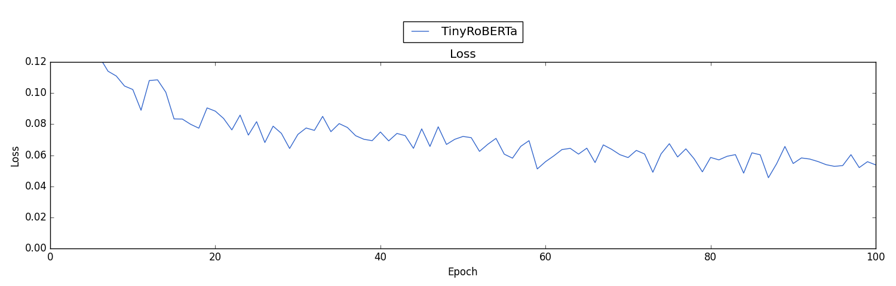
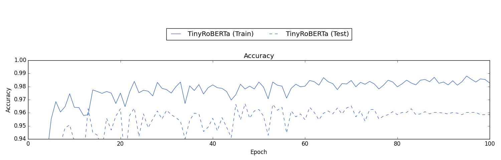
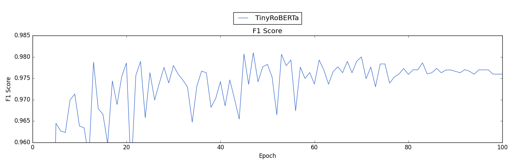

# Syscall Trace Classification

This project focuses on classifying syscall traces using two distinct methodologies: Graph Neural Networks (GNNs) and sequence models like BERT/RoBERTa. The primary goal is to
compare the effectiveness of these approaches in identifying patterns in syscall data, which are crucial for applications such as anomaly detection and malware identification.

## Graph Models

Utilizes GNNs like `['MLP', 'GCN', 'Sage', 'GIN']`, including Graph Attention Networks `['GAT', 'GATv2']`, to model syscall traces as graphs.

- A syscall trace is encoded into a graph by representing system calls as nodes with attributes derived from their type, token, and centrality measures (
  betweenness, closeness, Katz, and PageRank), while the sequential relationships between syscalls are encoded as directed edges with weights indicating the frequency of
  transitions between syscalls.
- An embedding layer is added to the GNN, which is used to generate the vector representation of each node's token. The token is given by the system call that the node
  represent. These vector representations serve as features of the node alongside the centrality measures.

## Transformer-based Models

Employs sequence models (like BERT/TinyBERT/RoBERTa) to analyze syscall sequences for pattern detection.

### Training

During training, the model processes syscall traces by taking a crop of `max_len` tokens from each trace. To enhance the model's robustness and ability to generalize, `15%` of
the tokens in each crop are masked randomly.

### Evaluation

For evaluation, each syscall trace is chunked into `n` samples of `max_len` with an overlap coefficient of `0.1`. Each chunk is then feed through the model, and the outputs (
either `logits` or `[CLS]` representations) are pooled together to form the final result for the entire trace.

## Dataset Preparation

Before running the models, the ADFA-LD dataset must be placed in the appropriate directory and preprocessed using provided scripts:

- Download the ADFA-LD dataset from the [ADFA-LD Dataverse](https://dataverse.harvard.edu/dataset.xhtml?persistentId=doi:10.7910/DVN/IFTZPF).
- Place the dataset in the `/datasets/ADFA-LD` directory within the project structure.
- Run `graph_preprocess` and `sequence_preprocess` scripts to prepare the data for training.

Note for datasets in which the traces are not tokenized (differently from the ADFA-LD), the tokenizer must be adapted accordingly.

## Initial Results

### Graph Models' Performance

The initial results of the classification models are visualized in the figures below, showcasing the performance metrics such as F1 score, accuracy, and loss over the training
epochs for the graph models.

**Loss**

**Accuracy (Train/Test)**

**F1 Score (Test)**

### Transformer-based Models

Still working on these, it achieves similar performance of the GNNs but with more instability. It's plausible that the models' complexity surpasses the requirements of the
ADFA-LD dataset.

**Loss**

**Accuracy (Train/Test)**

**F1 Score (Test)**
